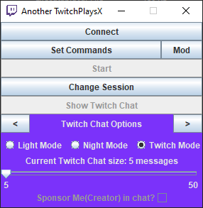

![alt text][logo]

[logo]: https://fontmeme.com/permalink/210517/3e4924b31b184892fc5b77d4a4ca094c.png

<span style="display:block;text-align:center"></span>

### Before Using App Reminder

* Requires Java 16;

* This is no where explicit so for now I'll leave a message here.
```
The Key escape is a special key that can be used to stop the app from running after pressing the button start. (You will know, do not fret)
```

[Download](https://github.com/TheNinjask/AnotherTwitchPlaysX/releases/latest)

<!-- omit in toc -->
## Table of Contents


- [Introduction](#introduction)
- [Features](#features)
- [Modding](#modding)
- [F.A.Q. with out the F.A.](#faq-with-out-the-fa)
- [Bugs](#bugs)
- [Future](#future)
- [Libraries Used](#libraries-used)


## Introduction

This app was made with the intention to any type of user to have it easy to play with their chat maybe just their chat alone.

So I hope you can have fun using this application!

## Features

Well as the name of the app says its another TwitchPlays app.
I am a bit bad at explaining thing in text but if you use the app I hope it is intuitive enough.
* Set commands with control(s) assigned;
* The commands have (minimum for now) support for variables! e.g. type in chat !test 1 2 can correspond to move mouse to (1,2)
* Support for mods (if someone develops)
* Display twitch chat (wow really? that so hard /s)
* and more! ("and more!" may not be included.)

## Modding

Yes! In this application, you can load a single mod (but is there can be a mod that loads multiple mods but for now I am not doing that.)

To make a mod for this app, you start a maven project and add the following [dependency](https://github.com/TheNinjask/AnotherTwitchPlaysX/packages/805306)
```
<dependency>
  <groupId>pt.theninjask</groupId>
  <artifactId>anothertwitchplaysx</artifactId>
  <version>1.1.1</version>
</dependency>
```
and when you use mvn package, the .jar created has to be a fat .jar (but it won't require the dependency above.)

Here a plugin to help you create one that also excludes unnecessary dependencies from the fat .jar file.
```
<plugin>
	<groupId>org.apache.maven.plugins</groupId>
	<artifactId>maven-shade-plugin</artifactId>
	<version>3.2.4</version>
	<executions>
		<execution>
			<phase>package</phase>
			<goals>
				<goal>shade</goal>
			</goals>
			<configuration>
				<artifactSet>
					<excludes>
						<exclude>pt.theninjask</exclude>
						<exclude>org.kitteh.irc</exclude>
						<exclude>com.fasterxml.jackson.core</exclude>
						<exclude>com.1stleg</exclude>
					</excludes>
				</artifactSet>
			</configuration>
		</execution>
	</executions>
</plugin>
```

It will be required for the mod at least 1 class (it will be the first that it finds) with the annotation `@Mod` with the value `main` as `true` which is by default and must have an public empty constructor.

Also there will be 3 types of mods:
* First Party - That will show no problems.
* Third Party approved - This will show a message when loading that has be approved by me/us.
* Unknown - This will show a warning message that the code being loaded has not been overseer by me (the user will have the option to opt out of loading the mod.) 

If you wish to be a Third Party approved, for now you'll have to wait.

For any issues/wishes please refer to [bugs](#bugs) section (even tho it might not be a bug) and feel free to say the problem/wish.

Example-Changing the Mod Button to say greetings to the user:

```
import java.awt.event.ActionListener;

import javax.swing.JButton;
import javax.swing.JLabel;
import javax.swing.JOptionPane;
import javax.swing.JPanel;

import pt.theninjask.AnotherTwitchPlaysX.gui.mainMenu.MainMenuPanel;
import pt.theninjask.AnotherTwitchPlaysX.gui.mod.Mod;
import pt.theninjask.AnotherTwitchPlaysX.gui.mod.ModPanel;
import pt.theninjask.AnotherTwitchPlaysX.util.Constants;

@Mod(hasPanel = false)
public class HelloWorld implements ModPanel {

	public HelloWorld() {
		JButton modButton = MainMenuPanel.getInstance().getModButton();
		for (ActionListener elem : modButton.getActionListeners()) {
			modButton.removeActionListener(elem);
		}
		modButton.addActionListener(l->{
			Constants.showMessageDialog("Greetings World!", "Title-Hello World!");
		});
	}
	
	@Override
	public JPanel getJPanelInstance() {
		return null;
	}

	@Override
	public void refresh() {
		//DO NOTHING
	}

}
```

## F.A.Q. with out the F.A.

<!-- omit in toc -->
### I don't see a question in here that I wanted to check. How can you address it?

Wait a second.

(ctrl+c,ctrl+v)

For any issues/wishes please refer to [bugs](#bugs) section (even tho it might not be a bug) and feel free to say the problem/wish.

<!-- omit in toc -->
### Why is the UI so small?

Because I actually kinda liked it but I hid behind the excuse of to make me think to use the space more carefully. For example, I ran out of space for more twitch chat options, so I made that slider to preserve the size and still be intuitive enough for users!
<!-- omit in toc -->
### Why is there no support for controllers

The first intention of this project (even tho it can't be seen through the commits) was to have controller support. But arised the problem that it would require for the user to install another requirement (I had and still have the objective to not have to many requirements) and if there would be an external requirement, I would like that the app itself installed it. `Then why are you using Java if you want the least requirements possible?` Well because is the language I am most used to and I kinda like it, I still like C and Python and at some point in the beginning thought of using Python but I decided to go for Java.
<!-- omit in toc -->
### I don't like/know how to use the UI. Is there a other way?

I also wanted to be a other way to setup the commands without relying on the UI so you can write a JSON file with the following below and load your written file.
```
[
	#this will be a comment, but remember JSON does not support it
	#this is an array of CommandData
	#CommandData - is a single commands that will correspond to a single or multiple actions
	{
		lead: String, #literal string to match the command
		type: "String", #UNISON only (or QUEUE but it is to be decided if it will be implemented)
		#the list with the controls to execute
		controls:[
			{
				#type == MOUSE or MOUSE_DRAG (or MOUSE_WHEEL (it is not in the UI but as I am writing this I think it is implemented))
				key: Number, #Number to reprensent the mouse button pressed
				duration: Number, #Represent the duration of pressing said button,
				aftermathDelay: Number, #It is unused but it represents the wait until it executes the next control in the list (or overall if QUEUE)
				#Description of details of the types MOUSEs
				inDepthCursor:{
					x: Number, #x position for MOUSE or initial x position for MOUSE_DRAG
					y: Number, #y position for MOUSE or initial y position for MOUSE_DRAG
					finalX: Number, #final x position for MOUSE_DRAG
					finalY: Number, #final y position for MOUSE_DRAG
					scroll: Number #reminder that scroll may be implemented but was never tested
				},
				#mapping of vars in the command to certain variables for control
				#it will work like
				# regex produced: !test\s?(?<A>\d*)
				# !test 420 
				#map.get(duration) -> null or A (in this case)
				#vars.get(A) -> 420
				map:{
					ControlData's VarName: CommandData's VarName,
					.
					.
					.
				}
			},
			{
				#type == KEY
				key: Number, #represent the key in keyboard pressed
				duration: Number, #time for holding down the key,
				aftermathDelay: Number, #It is unused but it represents the wait until it executes the next control in the list (or overall if QUEUE),
				map:{
					#see in #type == MOUSE section
					.
					.
					.
				}
			},
			.
			.
			.
		],
		#the list of vars with their type 
		vars:[
			{
				key: String, #varname
				type: "String" #DIGIT or STRING
			},
			.
			.
			.
		]
	},
	.
	.
	.
]
```

## Bugs

Create an issue following a template in ISSUES_TEMPLATE. If you feel that there is no suitable template, at least write the issues as simple and precise as possible.

## Future
For now, I do not intend to touch more this project besided to fix any issues at the beginning but if this somehow takes off I'll try to make time for it and for both futures that why I at the last minute decided to add support for mods as it will allow at least for it to be able to grow even if I am not present.

## Libraries Used

I'll like to give credits to:

* [KittehOrg](https://github.com/KittehOrg) for [Kitteh IRC Client Library](https://github.com/KittehOrg/KittehIRCClientLib) to allow connection with Twitch;
* [Alex Barker](https://github.com/kwhat) for [JNativeHook](https://github.com/kwhat/jnativehook) for the global keyboard and mouse listeners;
* [Universal-Team](https://github.com/Universal-Team) from the [Pokémon Chest Team](https://github.com/Universal-Team/pkmn-chest) for the templates.
